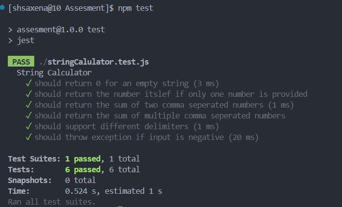

# incubyte-assessment

<h1>Project Title</h1>

String Calculator using TDD

<h1>Screenshots of the output is added in the image folder </h1>

<h2>Steps to run the Project</h2>

<ul>
<li>git clone</li>
<li>navigate to the project directory</li>
<li>npm install</li>
<li>add jest under script in package.json (if not added)</li>

<li>run <b>"npm test"</b> to execute test</li>
</ul>

<h2>Output Screenshot</h2>

